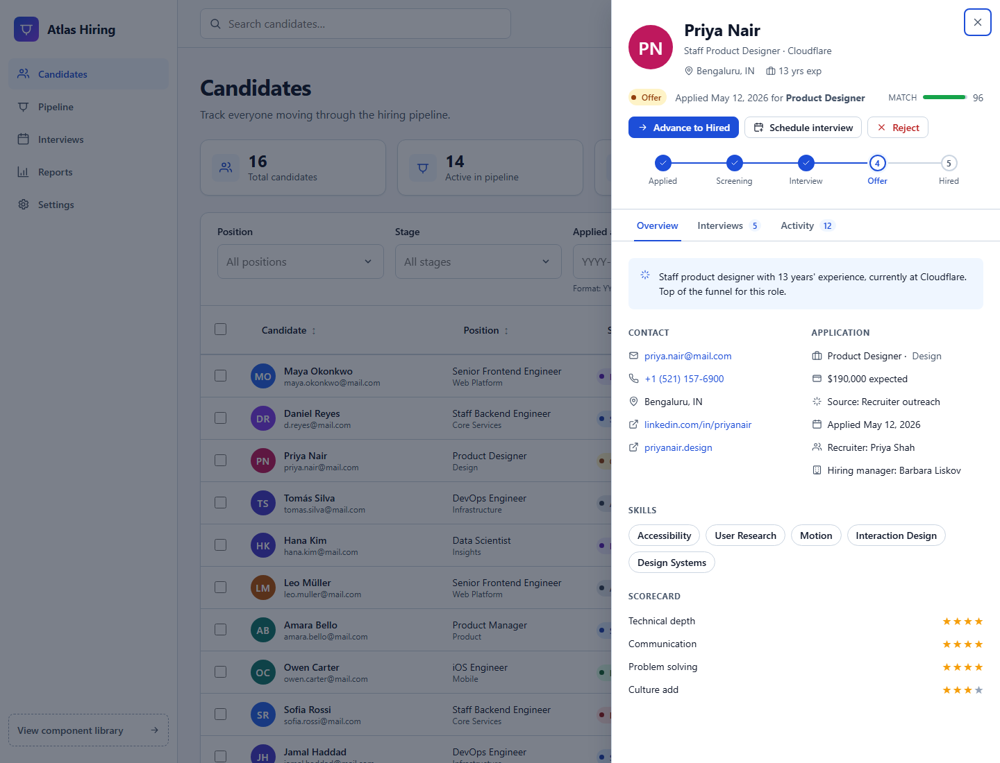
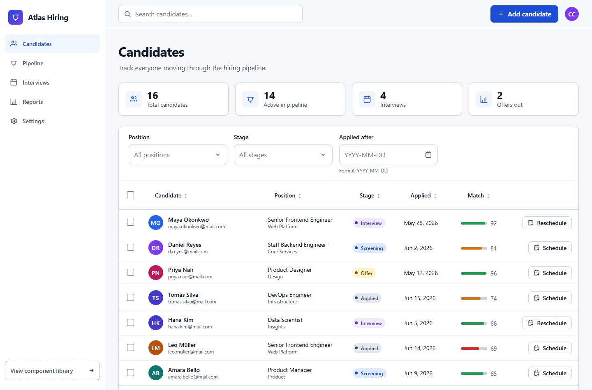
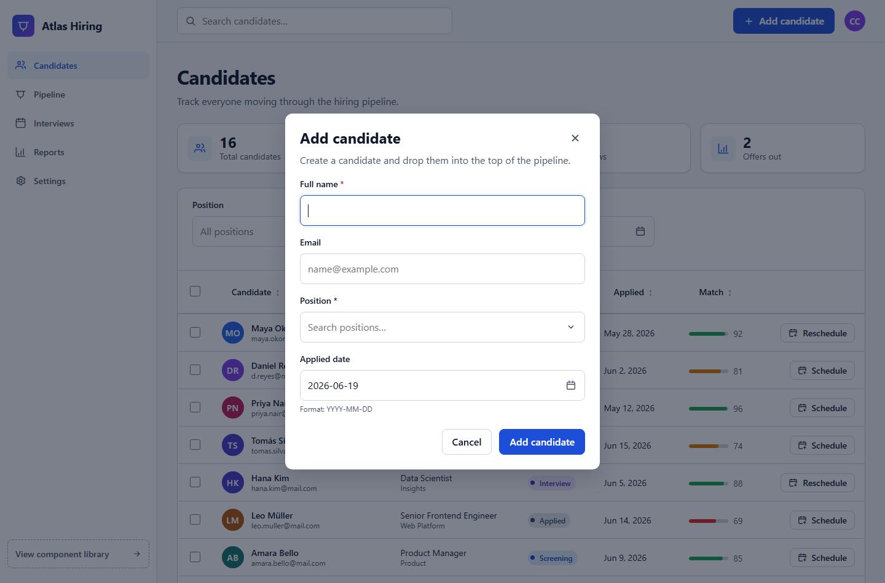

# Atlas Hiring — accessibility-first React, built from scratch

A complete **hiring-pipeline dashboard** ("Atlas Hiring") built on a set of
custom, accessibility-first UI primitives — **no UI framework**, just React +
TypeScript and the [WAI-ARIA Authoring Practices](https://www.w3.org/WAI/ARIA/apg/).

The app is the real product; the components are the reusable layer underneath it.
Both ship in this repo, and you can flip between them in the running app
("View component library" in the sidebar).

**🔗 Live demo:** **[a11y-components-ten.vercel.app](https://a11y-components-ten.vercel.app/)** &nbsp;·&nbsp; **Stack:** React 18 · TypeScript (strict) · Vite · Vitest · zero UI dependencies



<p align="center">
  
  
</p>

## The application

`Atlas Hiring` is a recruiter's candidate dashboard that exercises every
component in a believable workflow:

- **Candidates data table** — sortable columns (name, position, stage, applied
  date, match score), row selection with **bulk actions** (move to
  Screening/Interview, reject), avatars, colored stage badges, and score bars.
  A real loading state on first fetch and a contextual empty state when filters
  match nothing.
- **Candidate detail drawer** — clicking a candidate opens a focus-trapped
  slide-over with the full record: profile + contact + links, application
  details (position, salary expectation, source, recruiter, hiring manager), a
  **pipeline stage stepper**, skills, a competency **scorecard**, the complete
  **interview schedule/history** (interviewer, time, status, score, feedback),
  and an **activity timeline** you can post notes to. Accessible **tabs**
  (Overview / Interviews / Activity) with arrow-key navigation. Inline actions
  advance, reject, or schedule directly from the drawer.
- **Filter toolbar** — a **combobox** to filter by position, a **combobox** to
  filter by stage, and a **date picker** for "applied after", plus free-text
  search and a clear-filters affordance.
- **Add candidate modal** — a focus-trapped dialog whose form embeds the
  **combobox** (position) and **date picker** (applied date) with validation.
- **Schedule interview modal** — assign an interviewer (**combobox**) and pick a
  date (**date picker**); confirming advances the candidate to the Interview
  stage with a polite toast announcement.
- **Stats, toasts, dark mode, responsive layout** — the surrounding product chrome.

## The component library

Four polished, reusable components, each fully keyboard-navigable and
screen-reader correct, also showcased in a Storybook-style demo page:

| Component | ARIA pattern | Highlights |
|-----------|--------------|------------|
| **Modal** | `dialog` (modal) | Focus trap, scroll lock, focus restoration, portal |
| **Combobox** | `combobox` + `listbox` | `aria-activedescendant` roving, inline filter, loading/empty |
| **DatePicker** | date-picker dialog (`grid`) | Roving tabindex, full arrow/Page navigation, min/max bounds |
| **DataTable** | semantic `table` | `aria-sort` columns, indeterminate select-all, loading/empty |

## Quick start

```bash
npm install
npm run dev        # open the demo page (Vite)
npm test           # run the component test suite (Vitest + Testing Library)
npm run build      # type-check + production build
```

## Why these components are accessible

The interesting work is in the edge cases that screen-reader and keyboard users
hit but mouse users never see:

- **Focus trapping & restoration** — `useFocusTrap` moves focus into a dialog,
  wraps `Tab`/`Shift+Tab` at both boundaries, and restores focus to the exact
  element that opened it (guarding against that element having been unmounted).
- **`aria-activedescendant` instead of moving focus** — the combobox keeps DOM
  focus on the input while a "virtual" active option moves through the list,
  which is what `combobox`/`listbox` widgets are supposed to do. Disabled
  options are skipped during navigation.
- **Roving `tabindex` in the calendar grid** — only the focused day is tabbable;
  arrow keys move focus, and the focused date is announced via a live region.
- **`aria-sort` and real checkboxes** — the table reflects sort direction on the
  header cells and uses a genuine indeterminate (mixed) state for select-all,
  rather than re-implementing controls with `div`s.
- **First-class empty & loading states** — both are rendered *and* announced
  through a polite `role="status"` region, so they aren't silent to AT.
- **Reduced motion & color contrast** — animations collapse under
  `prefers-reduced-motion`, dark mode is supported, and the token palette meets
  WCAG AA contrast.

## Project layout

```
src/
  app/            Atlas Hiring application
    HiringApp.tsx   shell: sidebar, topbar, stats, filters, table, modals, toasts
    CandidateDrawer.tsx  full candidate record (profile, interviews, activity)
    AddCandidateModal.tsx / ScheduleInterviewModal.tsx
    data.ts         candidates + deterministic record generator
    ui.tsx          avatars, stage badges, score bars, stars, icons, toasts
    app.css / drawer.css
  lib/            the reusable component library
    components/   Modal, Combobox, DatePicker, DataTable (+ co-located CSS & tests)
    hooks/        useFocusTrap, useOnClickOutside, useScrollLock
    dateUtils.ts  dependency-free date math
    index.ts      public API barrel
  demo/           the Storybook-style showcase page
  styles/         design tokens + global styles
```

## Tech

- **React 18 + TypeScript** (strict mode, no `any`).
- **Vite** for dev/build, **Vitest + @testing-library/react** for tests that
  assert behavior through the accessibility tree (roles, names, focus), not
  implementation details (22 tests across components and the app).
- Zero runtime dependencies beyond React.

## License

[MIT](LICENSE) © Christian Correa
